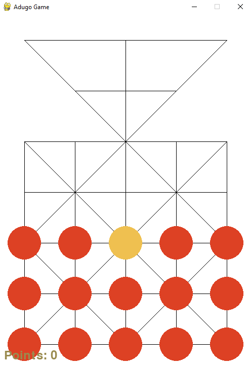

# Adugo Game

Adugo é um jogo tradicional de tabuleiro da tribo Bororo, nativos do Brasil. Este projeto implementa o jogo Adugo em Python usando Pygame. O jogador controla a onça (jaguar) enquanto a IA controla os cachorros. O objetivo é capturar todos os cachorros ou impedir os movimentos da onça.

## Requisitos

- **Python 3.6 ou superior**
- **Pygame 2.0 ou superior**

## Instalação

1. **Clone o repositório:**

   ```bash
   git clone https://github.com/seu_usuario/adugo-game.git
   cd adugo-game
   ```

2. **Crie e ative um ambiente virtual (opcional, mas recomendado):**

   ```bash
   python3 -m venv venv
   source venv/bin/activate  # No Windows: venv\Scripts\activate
   ```

3. **Instale as dependências:**

   ```bash
   pip install pygame
   ```

## Como jogar

### Objetivo

- **Jaguar (jogador):** Capture 6 cachorros para vencer o jogo.
- **Cachorros (IA):** Impeça que a onça se mova, bloqueando todas as suas opções.

### Controles

- **Movimento do jaguar:** Clique sobre a onça para selecioná-la e clique em uma posição válida para movê-la.
- **Movimento dos cachorros:** A IA controla os cachorros, que tentarão bloquear a onça e evitar serem capturados.
- **Captura:** Se um cachorro estiver adjacente à onça e houver uma célula vazia na direção oposta, o jogador pode capturar o cachorro clicando sobre ele.

### Reiniciar o jogo

- Após uma vitória ou derrota, pressione a barra de espaço (`SPACE`) para reiniciar o jogo.

## Mecânica do Jogo

### Tabuleiro

O tabuleiro consiste em uma grade 5x7 onde os cachorros começam espalhados e a onça começa no centro.

### Condições de Vitória

- **Jaguar vence:** Captura 6 cachorros.
- **Cachorros vencem:** Imobilizam a onça, de forma que ela não tenha movimentos válidos.

### Avaliação do Tabuleiro

A IA utiliza o algoritmo **Minimax** com uma função de avaliação heurística que considera:
- **Segurança dos cachorros**
- **Ameaça à onça**
- **Controle central do tabuleiro**

## Interface do Usuário

O jogo possui uma interface simples:
- **Amarelo** representa a onça.
- **Vermelho (Tango)** representa os cachorros.
- Peças selecionadas são destacadas em **amarelo-claro**.
- A pontuação (cachorros capturados) é exibida no canto inferior esquerdo.
- Uma mensagem de vitória ou derrota será exibida no canto superior direito.

## Contribuindo

Se deseja contribuir:
1. Faça um fork do repositório.
2. Crie um branch para suas mudanças (`git checkout -b minha-mudanca`).
3. Commit suas mudanças (`git commit -m 'Minha mudança incrível'`).
4. Envie suas alterações (`git push origin minha-mudanca`).
5. Abra um pull request no GitHub.

## Licença

Este projeto está licenciado sob a licença MIT. Veja o arquivo `LICENSE` para mais detalhes.

## Capturas de Tela



## Autor

Feito com ❤️ por [Ricardo Trovato](https://github.com/devrictrovato).